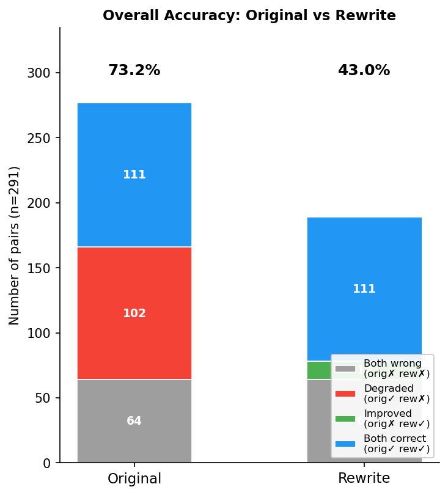
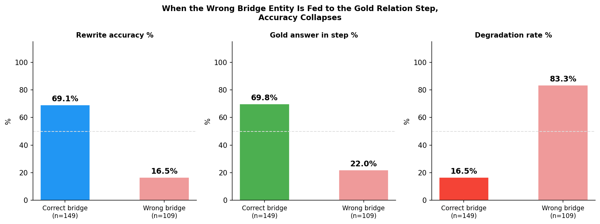

# Sub-Question Order Experiment  —  2WikiMultiHop

## Setup

All questions in this dataset are **2-hop**:

```
Entity_0  --[Hop1]-->  Bridge Entity  --[Hop2 / Gold Relation]-->  Final Answer
```

We take 291 questions and create two versions of each:

| Version | Q1 strategy |
|---|---|
| **Original** | Q1 asks the first hop directly — a high-selectivity anchor (film title, person name, specific role) that uniquely identifies the bridge entity |
| **Rewrite** | Q1 asks an added constraint — a low-selectivity filter (citizenship, birthdate, award) that many entities satisfy |

The model answers by decomposing the question into sub-questions Q1…Qn, retrieving an intermediate answer for each, then combining them into a final prediction.

---

## Definitions

### Gold Relation Step (Hop2)

The **gold relation step** is the sub-question that applies Hop2 to the bridge entity to produce the final answer. It is identified syntactically as the **last sub-question** that:
- references a previous answer via `#N` in its text, **and**
- has a factual (non yes/no) intermediate answer

### Bridge Entity

The **bridge entity** is the intermediate entity fed as input to the gold relation step — the answer to the sub-question labelled `#N` that the gold step references.

In the original chain, the bridge entity is always Q1's answer (the direct result of Hop1).

### Example

```
Question: Who is the child of the director of Mukhyamantri (1996)?

Original (2 steps):
  Q1: "Who directed Mukhyamantri?"           → Anjan Choudhury     ← Hop1 / bridge entity
  Q2: "Who is the child of #1?"              → Chumki Chowdhury    ← Hop2 / gold relation step
  Bridge entity fed to Q2 = Q1's answer = Anjan Choudhury  ✓

Rewrite (4 steps, adds citizenship constraint as Q1):
  Q1: "Who has citizenship in British Raj?"  → Pandit Jawaharlal Nehru   ← WRONG bridge entity
  Q2: "Who was born Nov 25 1944, directed Mukhyamantri?"  → Anjan Choudhury
  Q3: "Is #2 the same as #1?"               → no
  Q4: "Who is the child of the person in #3?"→ Frances Bean Cobain  ← gold relation step
  Bridge entity fed to Q4 = Q3's answer = "no"  ✗  (Anjan Choudhury found at Q2 but not used)
  Prediction: Frances Bean Cobain  ✗   Gold: Chumki Chowdhury
```

The rewrite's Q1 (citizenship constraint) retrieved the wrong bridge entity. The correct entity (Anjan Choudhury) appeared at Q2 but the model did not route it to the gold step.

---

## Research Questions

1. **Q1 — Does rewrite Q1 retrieve the correct bridge entity?**
2. **Q2 — When Q1 is wrong, where does the correct entity appear in the rewrite chain, and does the gold step use it?**
3. **Q3 — When the wrong bridge entity is fed to the gold relation step, does accuracy collapse?**

---

## Overall Accuracy

The rewrite causes a large accuracy drop:

| | Correct | Accuracy |
|---|---|---|
| Original | 213 / 291 | **73.2%** |
| Rewrite  | 125 / 291 | **43.0%** |
| Δ | −88 | **−30.2 pp** |

| Outcome | n | % |
|---|---|---|
| Both correct  (orig✓ rew✓) | 111 | 38.1% |
| **Degraded    (orig✓ rew✗)** | **102** | **35.1%** |
| Improved      (orig✗ rew✓) | 14 | 4.8% |
| Both wrong    (orig✗ rew✗) | 64 | 22.0% |



---

## Q1: Does Rewrite Q1 Retrieve the Correct Bridge Entity?

Each rewrite's Q1 is an added constraint (citizenship, birthdate, description, …) rather than the original's direct Hop1 question. We check whether Q1's answer matches the original bridge entity.

| Q1 outcome class | n | % | Rewrite acc | Degrade rate |
|---|---|---|---|---|
| Q1 retrieves **correct** bridge entity | 150 | 51.5% | 68.0% | 16.2% |
| Q1 wrong, correct entity found & used by gold step | 6 | 2.1% | 50.0% | 50.0% |
| Q1 wrong, correct entity found but **not used** by gold step | 31 | 10.7% | 19.4% | 75.0% |
| Q1 wrong, correct entity **never found** in rewrite | 81 | 27.8% | 14.8% | 85.2% |
| Bridge entity not identifiable | 23 | 7.9% | 8.7% | 90.9% |

In **40.5% of pairs** (118/291), rewrite Q1 retrieves the wrong bridge entity. In only **51.5%** does it get the right one immediately.


**Examples:**

```
Q1 CORRECT — rewrite Q1 finds the right bridge entity
  Question : Where did the director of The Decision Of Christopher Blake die?
  Orig Q1  : "Who directed The Decision Of Christopher Blake?"  → Peter Godfrey  ← bridge
  Rew  Q1  : "Who worked in film/TV and died of Parkinson's...?" → Peter Godfrey  ✓ (correct bridge)
  Rew  Q2  : "In which city did #1 pass away?"                   → Hollywood  ✓

Q1 WRONG, NOT FOUND — wrong entity, gold answer never reached
  Question : Where did Edward Hoby's father study?
  Orig Q1  : "Who is Edward Hoby's father?"                 → Thomas Hoby  ← bridge
  Rew  Q1  : "Who was awarded Knight Bachelor, listed in DNB?" → Sir William Comer Petheram  ✗
  Rew  Q3  : "Which college did #1 attend?"                  → University of Calcutta  ✗
  Bridge entity (Thomas Hoby) never appears anywhere in rewrite chain.
```

---

## Q2: When Q1 Is Wrong, Where Does the Correct Entity Appear?

Of the **118 pairs** where Q1 retrieved the wrong entity:

| | n | % of wrong-Q1 cases |
|---|---|---|
| Correct entity found somewhere in rewrite chain | 37 | 31.4% |
| → and **used** as input to gold step (recovery) | 6 | 16.2% of those found |
| → found but **not used** by gold step | 31 | 83.8% of those found |
| Correct entity **never found** anywhere in rewrite | 81 | 68.6% |

When the correct entity does appear, it is almost always at Q2 of the rewrite chain — the step right after the wrong Q1. But in 84% of cases, the gold relation step references Q1 (wrong entity) or a verification result, not Q2, so the correct entity is never used.

| Position of first correct entity appearance | n | Actually used by gold step |
|---|---|---|
| Q2 | 25 | 5 |
| Q3 | 10 | 1 |
| Q4 | 2 | 0 |


**Example — correct entity found but not used:**

```
  Question : Who is the child of the director of Mukhyamantri (1996)?
  Bridge   : Anjan Choudhury

  Rew Q1: "Who has citizenship in British Raj?"         → Pandit Jawaharlal Nehru  ✗
  Rew Q2: "Who was born Nov 25 1944, directed Mukhyamantri?" → Anjan Choudhury  ✓ (correct entity appears here)
  Rew Q3: "Is #2 the same as #1?"                       → no
  Rew Q4: "Who is the child of the person in #3?"       → Frances Bean Cobain  ← gold step uses #3="no"
  Correct entity (Q2=Anjan Choudhury) is present but gold step references Q3, not Q2.
```

---

## Q3: When the Wrong Bridge Entity Reaches the Gold Step, Does Accuracy Collapse?

We compare pairs where the gold relation step receives the correct vs wrong bridge entity as input:

| Bridge entity fed to gold step | n | Rewrite acc | Gold answer in step | Degrade rate |
|---|---|---|---|---|
| **Correct** bridge entity | 149 | **69.1%** | 69.8% | 16.5% |
| **Wrong** bridge entity | 109 | **16.5%** | 22.0% | 83.3% |



When the correct bridge entity reaches the gold relation step, the rewrite succeeds at 69% — close to the original's 73%. When the wrong entity is fed to the gold step, accuracy collapses to 16.5% and 83% of originally-correct pairs degrade.


---

## Key Finding

The causal chain is:

```
Rewrite Q1 = low-selectivity constraint
  → retrieves wrong bridge entity (40.5% of pairs)
    → wrong entity propagated to gold relation step (Hop2)
      → gold relation applied to wrong entity → wrong final answer
        → accuracy collapses (83% degradation rate)
```

**Rewrite Q1 is wrong in 40.5% of pairs.** When wrong, the correct bridge entity is found later in the chain (Q2, Q3) in 31% of those cases, but the model almost never reroutes it to the gold relation step. The wrong entity silently propagates through the chain.

**The controlling factor is bridge entity correctness at the gold relation step**, not the position of the gold relation step itself. When the correct bridge entity reaches the gold step (regardless of position), the chain succeeds at 69%. When the wrong entity arrives there, it fails at 83%.

---

## Experiment 1 Cross-Group Results  (from `../order_experiment.py`)

| Group | n | V→no | V→yes | Gold in rewrite chain | Gold in original chain |
|---|---|---|---|---|---|
| Both correct (orig✓ rew✓) | 111 | 9.0% | 16.2% | 94.6% | 95.5% |
| Both wrong (orig✗ rew✗) | 64 | 31.2% | 9.4% | 23.4% | 32.8% |
| Rewrite better (orig✗ rew✓) | 14 | 14.3% | 7.1% | 92.9% | 28.6% |
| **Original better (orig✓ rew✗)** | **102** | **35.3%** | **10.8%** | **18.6%** | **75.5%** |

**V→no**: verification step fired "no" — model confirmed Q1 retrieved the wrong entity.
**V→yes**: verification step fired "yes" — correct entity confirmed.

### Failure type breakdown (n=102 degradation cases)

| Type | Count | % | Cause |
|---|---|---|---|
| **A — Wrong-entity cascade** | **62** | **60.8%** | Q1 wrong bridge entity; downstream steps inherit the error (A1: explicit "no" gate, 31 cases; A2: silent propagation, 31 cases) |
| B — Synthesis failure | 19 | 18.6% | Gold answer reached in intermediates but wrong step output as final prediction |
| E — Date/comparison failure | 17 | 16.7% | Rewrite embeds explicit dates; retriever returns wrong dates or model outputs description instead of name |
| C — Format mismatch | 4 | 3.9% | Correct reasoning but prediction is a description, not an entity name |

Type A (wrong bridge entity cascade) accounts for **60.8%** of degradation — directly caused by low-selectivity Q1.

---

## Files

| File | Description |
|---|---|
| `original.jsonl` | Original questions with decomposition and intermediate answers |
| `original_score.jsonl` | Accuracy scores for original questions |
| `rewrite.jsonl` | Rewritten questions with added constraints |
| `rewrite_score.jsonl` | Accuracy scores for rewritten questions |
| `original_acc1_rewrite_acc0.jsonl` | Paired records for the 102 degradation cases |
| `order_experiment_results.json` | Per-example failure type classification (Experiment 1) |
| `figures/fig1_overall_accuracy.png` | Overall accuracy: original vs rewrite |
| `figures/fig2_q1_selectivity.png` | Q1 outcome class distribution and accuracy by class |
| `figures/fig3_bridge_entity_impact.png` | Accuracy when correct vs wrong bridge entity fed to gold step |
| `figures/fig4_bridge_recovery_position.png` | Where the correct entity appears in the rewrite chain |
| `figures/fig5_summary.png` | Causal chain: Q1 selectivity → bridge entity → accuracy |
| `../order_experiment.py` | Experiment 1 — cross-group comparison and failure type classification |
| `gold_relation_order.py` | Experiment 2 — gold relation and bridge entity analysis |
