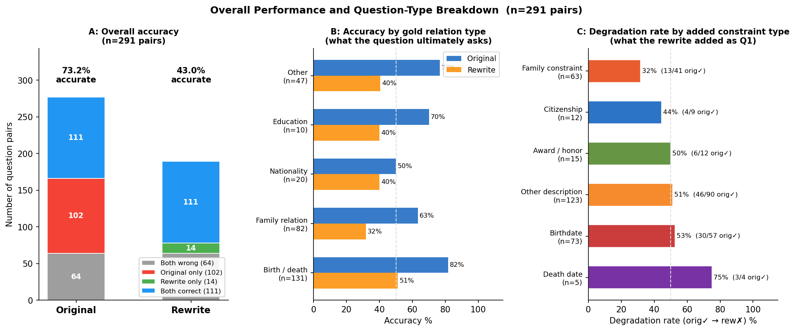
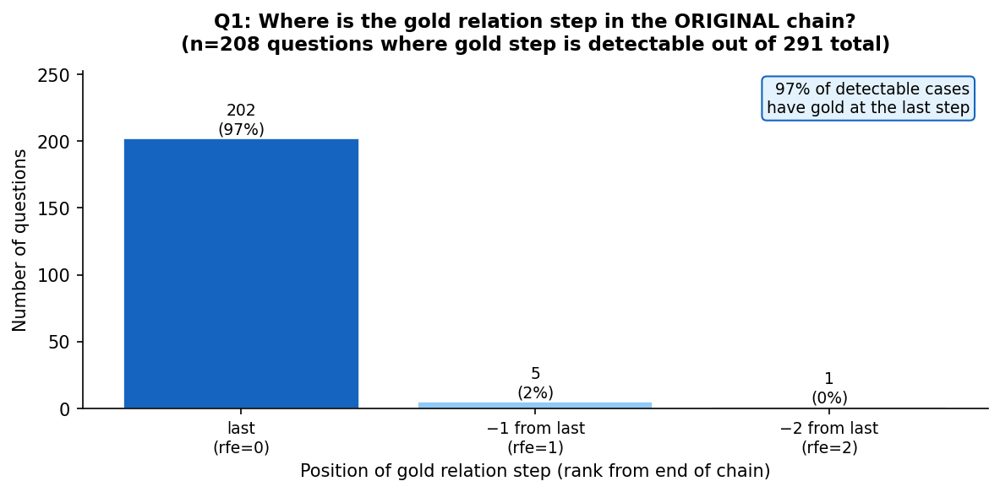
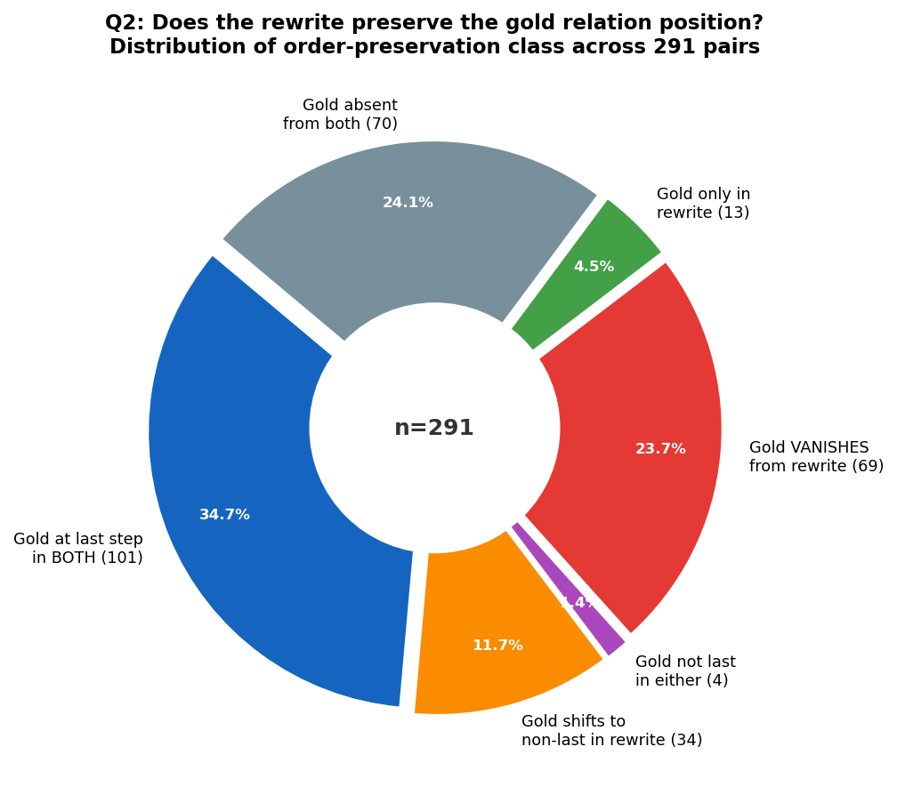
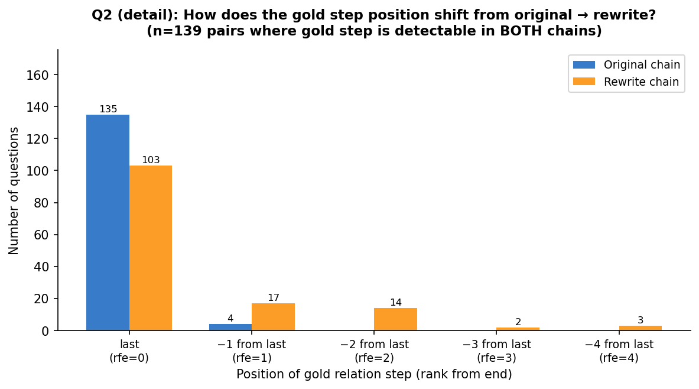
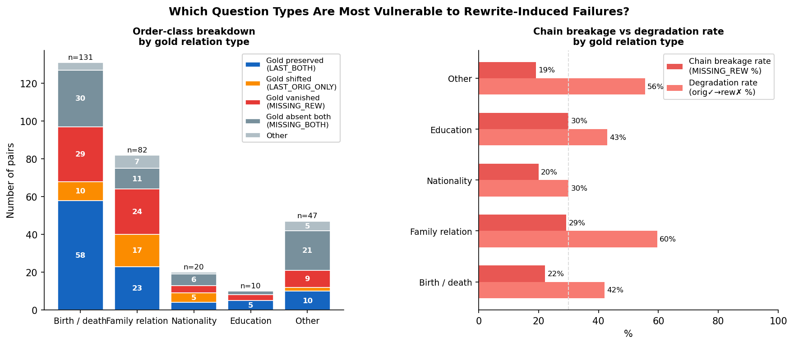
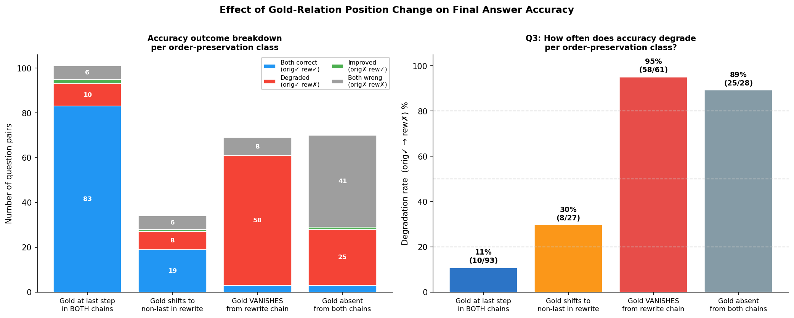
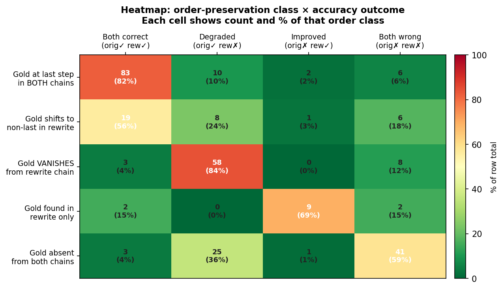
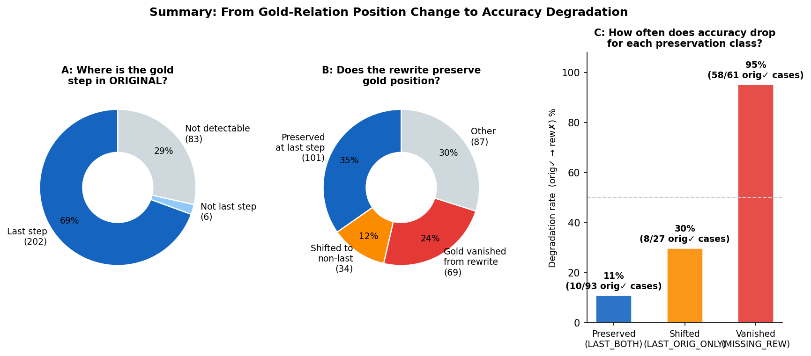

# Sub-Question Order Experiment

## What We Are Studying

We take 291 multi-hop questions from 2WikiMultiHop and create two versions of each:

| Version | How it is formed |
|---|---|
| **Original** | Question as written |
| **Rewrite** | Same question with extra relations added as constraints (e.g. citizenship, birth date, award) |

The model answers each question by decomposing it into sub-questions Q1 → Q2 → … → Qn, answering each with a retriever, then combining intermediate answers into a final prediction.

**Example:**

```
Original:  Who is the child of the director of Mukhyamantri (1996)?
  Q1: "Who directed Mukhyamantri?"   → Anjan Choudhury
  Q2: "Who is the child of Q1?"      → Chumki Chowdhury  ✓

Rewrite:   Who is the child of the person with citizenship in British Raj,
           born Nov 25 1944, who also directed Mukhyamantri?
  Q1: "Who has citizenship in British Raj?" → Pandit Jawaharlal Nehru  [WRONG]
  Q2: "Who directed Mukhyamantri?"          → Anjan Choudhury
  Q3: "Is Q2 the same as Q1?"               → no
  Q4: "Who is the child of Q3?"             → Frances Bean Cobain  [hallucinated]
  Prediction: Frances Bean Cobain  ✗   Gold: Chumki Chowdhury
```

We define the **gold relation step** as the sub-question whose intermediate answer equals the correct final answer. In the original above, Q2 is the gold relation step. In the rewrite, the gold answer never appears — the chain is broken.

---

## Overall Performance

The rewrite causes a large accuracy drop across all 291 pairs:

| | Accuracy | Correct |
|---|---|---|
| **Original** | **73.2%** | 213 / 291 |
| **Rewrite** | **43.0%** | 125 / 291 |
| **Δ** | **−30.2 pp** | −88 questions |

Outcome breakdown:

| Outcome | n | % |
|---|---|---|
| Both correct  (orig✓ rew✓) | 111 | 38.1% |
| **Degraded    (orig✓ rew✗)** | **102** | **35.1%** |
| Improved      (orig✗ rew✓) | 14 | 4.8% |
| Both wrong    (orig✗ rew✗) | 64 | 22.0% |



### Accuracy by question type

Questions are categorised by what the gold step ultimately asks.

| Question type | n | Orig acc | Rew acc | Δ | Degrade rate |
|---|---|---|---|---|---|
| Birth / death | 131 | 81.7% | 51.1% | −30.5 pp | 45/107 (42%) |
| Family relation | 82 | 63.4% | 31.7% | −31.7 pp | 31/52 (60%) |
| Nationality | 20 | 50.0% | 40.0% | −10.0 pp | 3/10 (30%) |
| Education | 10 | 70.0% | 40.0% | −30.0 pp | 3/7 (43%) |
| Other | 47 | 76.6% | 40.4% | −36.2 pp | 20/36 (56%) |

**Family relation questions degrade most** (60% of originally-correct cases become wrong). Birth/death questions are the most frequent but also start from the highest original accuracy (82%), so their absolute count of degradations (45) is high even though their degrade rate (42%) is lower.

### Degradation rate by what was added to the rewrite

Questions are categorised by the type of constraint added as the rewrite's Q1.

| Constraint added | n | Orig acc | Rew acc | Degrade rate |
|---|---|---|---|---|
| Death date | 5 | 80.0% | 40.0% | 3/4 (75%) |
| Birthdate | 73 | 78.1% | 39.7% | 30/57 (53%) |
| Other description | 123 | 73.2% | 40.7% | 46/90 (51%) |
| Award / honor | 15 | 80.0% | 40.0% | 6/12 (50%) |
| Citizenship | 12 | 75.0% | 50.0% | 4/9 (44%) |
| Family constraint | 63 | 65.1% | 50.8% | 13/41 (32%) |

**Low-selectivity temporal/demographic constraints (birthdate, death date) are the most damaging** — they match many entities so Q1 often retrieves the wrong one. **Family constraints degrade least** because they tend to be more specific (listing children's names, spouse, etc.) and the correct entity is more likely to be found uniquely.

### Accuracy by original chain length

| Original chain length | n | Orig acc | Rew acc | Degrade rate |
|---|---|---|---|---|
| 2 sub-questions | 247 | 71.7% | 48.6% | 71/177 (40%) |
| **3 sub-questions** | **42** | **81.0%** | **9.5%** | **30/34 (88%)** |

Three-step questions degrade catastrophically (88% degrade rate, rewrite accuracy drops from 81% to 10%). Longer original chains require the rewrite to add even more sub-questions, making the Q1 constraint even more likely to be non-selective and break the chain.

---

## Research Questions

We ask three questions in order, each building on the previous:

1. **Q1 — Where does the gold relation step appear in the original chain?**
2. **Q2 — When the rewrite adds extra constraints, does the model keep the gold relation step at the same position?**
3. **Q3 — When the position changes (or the step disappears entirely), does the final answer accuracy degrade?**

---

## Q1: Where is the gold relation step in the original chain?

> **Finding: It is almost always the last sub-question (97% of detectable cases).**

Of 291 original chains:
- 208 (71.5%) have the gold answer detectable in their intermediate steps
- 83 (28.5%) do not — these are hard questions where the retriever never surfaces the gold entity

Among the 208 detectable cases, the gold relation step sits at:

| Position | Count | % |
|---|---|---|
| **Last sub-question** | **202** | **97.1%** |
| Second-to-last | 5 | 2.4% |
| Third-to-last | 1 | 0.5% |

The original decomposition almost always follows the same structure: Q1 through Q(n−1) gather intermediate entities, and the final hop Qn produces the answer. This is the baseline we test against in Q2 and Q3.



---

## Q2: Does the rewrite preserve the gold relation position?

> **Finding: In 35% of pairs it is preserved. In 24% the gold answer vanishes from the rewrite chain entirely.**

When extra constraints are added, the model restructures the decomposition. We classify each pair into one of six outcome classes:

| Class | Definition | Count | % |
|---|---|---|---|
| **LAST_BOTH** | Gold at last step in **both** original and rewrite | 101 | 34.7% |
| **LAST_ORIG_ONLY** | Gold at last step in original, **not last** in rewrite | 34 | 11.7% |
| **NOT_LAST_BOTH** | Gold not at last step in either (comparison / date questions) | 4 | 1.4% |
| **MISSING_REW** | Gold found in original, **absent from rewrite** | 69 | 23.7% |
| **MISSING_ORIG** | Gold found in rewrite only (rewrite improves coverage) | 13 | 4.5% |
| **MISSING_BOTH** | Gold absent from both chains (intrinsically hard questions) | 70 | 24.1% |

The two most important classes are:
- **LAST_BOTH (35%)** — the rewrite adds new constraints but keeps the gold hop at the end. Order structurally preserved.
- **MISSING_REW (24%)** — the wrong entity is retrieved in Q1, so the gold answer never appears anywhere in the chain. This is the signature of the wrong-entity cascade.



When we look only at pairs where the gold step is detectable in both chains, the rewrite clearly pushes the gold step away from the last position:



Which question types experience the most order change and chain breakage?



**Family relation questions** have the highest chain breakage rate (MISSING_REW 29%) and the highest degradation rate (60%). **Birth/death questions** have more absolute failures but a lower chain breakage rate (22%) because their gold step often involves a date that the retriever can surface even from a wrong starting entity.

---

## Q3: When position changes, does accuracy degrade?

> **Finding: Position shift alone is a weak signal (+20pp). Disappearance of the gold step is catastrophic (95% degradation).**

We measure the **degradation rate**: the fraction of pairs where the original was correct but the rewrite was wrong, among pairs where the original was correct.

| Order class | What it means | Degradation rate |
|---|---|---|
| LAST_BOTH | Gold preserved at last step | **11%** (10/93) |
| LAST_ORIG_ONLY | Gold shifted to a non-last step | **30%** (8/27) |
| MISSING_REW | Gold answer vanished from rewrite chain | **95%** (58/61) |
| MISSING_BOTH | Gold absent from both (hard questions) | **89%** (25/28) |



The full accuracy breakdown across all four outcome groups (both correct / degraded / improved / both wrong) per order class:



**Interpretation:**

- **LAST_BOTH → 11% degradation (baseline):** Even when the gold relation stays at the last step, ~10% of rewrites still fail. These are synthesis errors (model reaches the right intermediate but outputs the wrong step) or format mismatches — not order-related at all.

- **LAST_ORIG_ONLY → 30% degradation:** When the gold step shifts to an earlier position (e.g. Q2 of 5 instead of Q2 of 2), accuracy drops 3× the baseline. The model can still succeed in 70% of cases — the positional shift is a real but mild signal.

- **MISSING_REW → 95% degradation:** This is the dominant failure mode. The gold answer is completely unreachable in the rewrite chain because Q1 retrieved the wrong entity. Every downstream step builds on that wrong entity, so the final prediction is almost always wrong.

---

## Summary

The three research questions answer in sequence:

**A → B → C** (see figure below)

- **A.** The gold relation step sits at the last position in 97% of original chains.
- **B.** The rewrite preserves this in only 35% of pairs. In 24% the gold answer vanishes from the chain entirely.
- **C.** Vanishing gold (MISSING_REW) → 95% degradation. Position shift alone (LAST_ORIG_ONLY) → 30% degradation. Gold preserved → 11% degradation (baseline noise).



**The decisive variable is not position — it is reachability.** When the gold answer appears anywhere in the rewrite's intermediate chain, accuracy is broadly maintained regardless of which step produces it. When the gold answer disappears entirely (wrong-entity cascade), the model almost always fails.

---

## Experiment 1: Cross-Group Analysis (order_experiment.py)

The earlier analysis (`../order_experiment.py`) approaches the same data from the verification-step angle rather than the gold-step angle. Its findings are consistent:

| Group | n | V→no | V→yes | Gold in rewrite chain | Gold in original chain |
|---|---|---|---|---|---|
| Both correct (orig✓ rew✓) | 111 | 9.0% | 16.2% | 94.6% | 95.5% |
| Both wrong (orig✗ rew✗) | 64 | 31.2% | 9.4% | 23.4% | 32.8% |
| Rewrite better (orig✗ rew✓) | 14 | 14.3% | 7.1% | 92.9% | 28.6% |
| **Original better (orig✓ rew✗)** | **102** | **35.3%** | **10.8%** | **18.6%** | **75.5%** |

**V→no**: verification step fired "no" — model confirmed Q1 retrieved the wrong entity.
**V→yes**: verification step fired "yes" — Q1 retrieved the right entity despite reordering.

Three observations:
1. **Order change is universal, not predictive.** ~97–98% of rewrites add a verification sub-question across all four groups. The mere presence of a verification step does not predict failure.
2. **V→no is the failure signal.** Concentrated in the two failing groups (35.3%, 31.2%) and nearly absent in the success groups (9.0%).
3. **Constraint selectivity controls the outcome.** When the added constraint uniquely identifies the target entity, V→yes and the chain succeeds. When it is non-selective, V→no and the chain collapses.

### Failure type breakdown (n=102 degradation cases)

| Type | Count | % | Cause |
|---|---|---|---|
| **A — Wrong-entity cascade** | **62** | **60.8%** | Q1 retrieves wrong entity; downstream steps inherit the error — via explicit "no" gate (A1, 31 cases) or silent propagation (A2, 31 cases) |
| B — Synthesis failure | 19 | 18.6% | Model reaches gold answer in intermediates but outputs the wrong step as the final prediction |
| E — Date/comparison failure | 17 | 16.7% | Rewrite embeds explicit dates; retriever returns wrong dates or model outputs a description instead of a name |
| C — Format mismatch | 4 | 3.9% | Correct reasoning but prediction is a description, not an entity name |

Type A (order-induced) accounts for **60.8%** of degradation. Types B, C, E are not caused by ordering.

---

## Files

| File | Description |
|---|---|
| `original.jsonl` | Original questions with decomposition and intermediate answers |
| `original_score.jsonl` | Accuracy scores for original questions |
| `rewrite.jsonl` | Rewritten questions with added constraints |
| `rewrite_score.jsonl` | Accuracy scores for rewritten questions |
| `original_acc1_rewrite_acc0.jsonl` | Paired records for the 102 degradation cases |
| `original_acc1_rewrite_acc0.summary.json` | Summary statistics for the degradation cases |
| `order_experiment_results.json` | Per-example failure type classification |
| `figures/fig0_overall_performance.png` | Overall accuracy + breakdown by question type and constraint type |
| `figures/fig1_q1_original_gold_position.png` | Q1: where the gold step sits in the original chain |
| `figures/fig2_q2_order_preservation_donut.png` | Q2: overall order-preservation class distribution |
| `figures/fig2b_q2_position_shift.png` | Q2: how the gold step position shifts from original to rewrite |
| `figures/fig3_q3_degradation_by_order_class.png` | Q3: degradation rate per order class |
| `figures/fig4_heatmap_order_vs_accuracy.png` | Q3: full cross-tabulation heatmap |
| `figures/fig5_summary_funnel.png` | Summary: A→B→C flow from original position to accuracy |
| `figures/fig6_order_class_by_question_type.png` | Which question types are most vulnerable to chain breakage |
| `../order_experiment.py` | Experiment 1 — cross-group comparison and failure type classification |
| `gold_relation_order.py` | Experiment 2 — gold relation position analysis (all figures above) |
