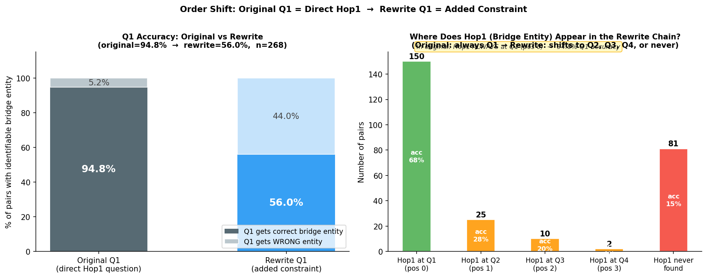
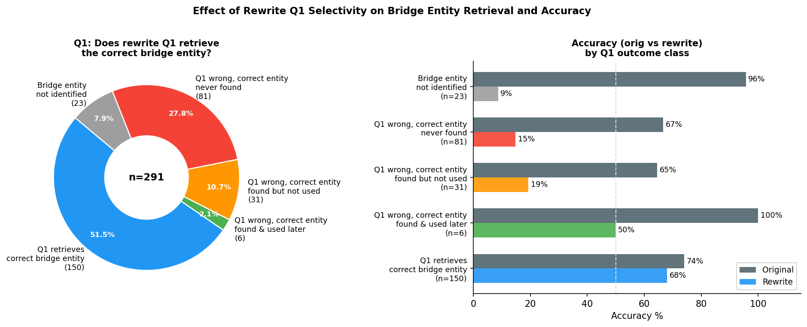
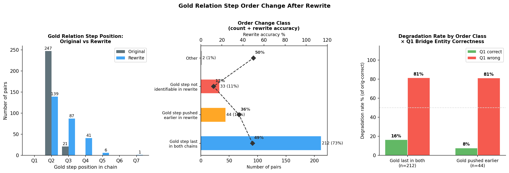
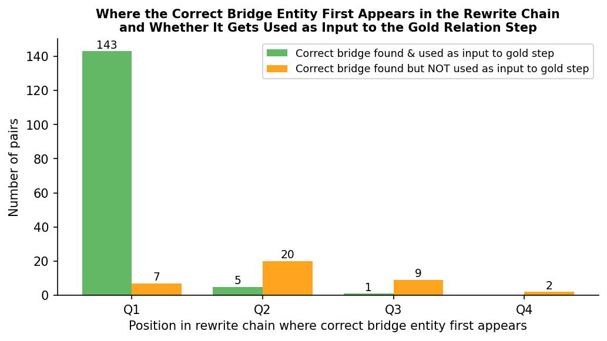
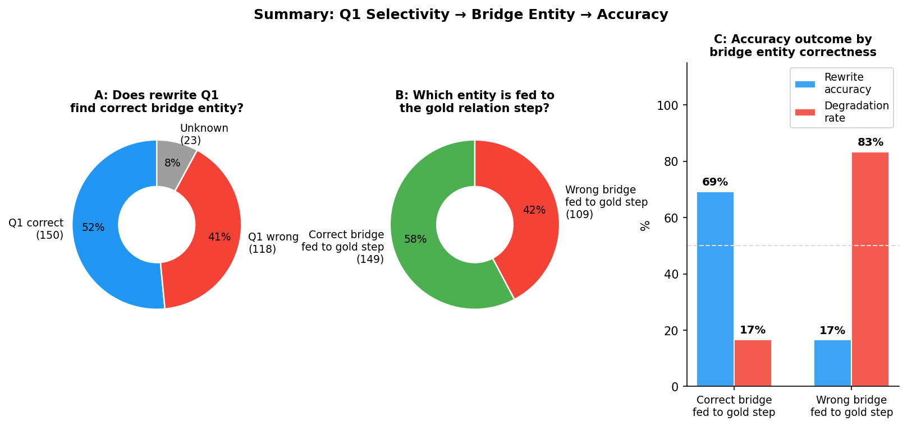

# Sub-Question Order Experiment  —  2WikiMultiHop

## Setup

All questions in this dataset are **2-hop**:

```
Entity_0  --[Hop1]-->  Bridge Entity  --[Hop2 / Gold Relation]-->  Final Answer
```

We take 291 questions and create two versions of each:

| Version | Q1 strategy |
|---|---|
| **Original** | Q1 asks the first hop directly — a high-selectivity anchor (film title, person name, specific role) that uniquely identifies the bridge entity |
| **Rewrite** | Q1 asks an added constraint — a low-selectivity filter (citizenship, birthdate, award) that many entities satisfy |

The model answers by decomposing the question into sub-questions Q1…Qn, retrieving an intermediate answer for each, then combining them into a final prediction.

---

## Definitions

### Gold Relation Step (Hop2)

The **gold relation step** is the sub-question that applies Hop2 to the bridge entity to produce the final answer. It is identified syntactically as the **last sub-question** that:
- references a previous answer via `#N` in its text, **and**
- has a factual (non yes/no) intermediate answer

### Bridge Entity

The **bridge entity** is the intermediate entity fed as input to the gold relation step — the answer to the sub-question labelled `#N` that the gold step references.

In the original chain, the bridge entity is always Q1's answer (the direct result of Hop1).

### Example

```
Question: Who is the child of the director of Mukhyamantri (1996)?

Original (2 steps):
  Q1: "Who directed Mukhyamantri?"           → Anjan Choudhury     ← Hop1 / bridge entity
  Q2: "Who is the child of #1?"              → Chumki Chowdhury    ← Hop2 / gold relation step
  Bridge entity fed to Q2 = Q1's answer = Anjan Choudhury  ✓

Rewrite (4 steps, adds citizenship constraint as Q1):
  Q1: "Who has citizenship in British Raj?"  → Pandit Jawaharlal Nehru   ← WRONG bridge entity
  Q2: "Who was born Nov 25 1944, directed Mukhyamantri?"  → Anjan Choudhury
  Q3: "Is #2 the same as #1?"               → no
  Q4: "Who is the child of the person in #3?"→ Frances Bean Cobain  ← gold relation step
  Bridge entity fed to Q4 = Q3's answer = "no"  ✗  (Anjan Choudhury found at Q2 but not used)
  Prediction: Frances Bean Cobain  ✗   Gold: Chumki Chowdhury
```

The rewrite's Q1 (citizenship constraint) retrieved the wrong bridge entity. The correct entity (Anjan Choudhury) appeared at Q2 but the model did not route it to the gold step.

---

## Research Questions

In the **original** chain, Q1 always asks the direct first hop (e.g. *"Who directed Mukhyamantri?"*) — a high-selectivity anchor that uniquely identifies the bridge entity.

In the **rewrite** chain, Q1 is replaced by an added constraint (citizenship, birthdate, description, award, …) that is supposed to identify the same bridge entity indirectly. This added constraint is often low-selectivity: many entities satisfy it, so Q1 may retrieve the wrong person.

> **Q1 — After adding relations to the question, does the first sub-question fail to find the correct bridge entity?**
>
> **Q2 — When the first sub-question fails, does the final answer become incorrect?**

---

## Overall Accuracy

| | Correct | Accuracy |
|---|---|---|
| Original | 213 / 291 | **73.2%** |
| Rewrite  | 125 / 291 | **43.0%** |
| Δ | −88 | **−30.2 pp** |

| Outcome | n | % |
|---|---|---|
| Both correct  (orig✓ rew✓) | 111 | 38.1% |
| **Degraded    (orig✓ rew✗)** | **102** | **35.1%** |
| Improved      (orig✗ rew✓) | 14 | 4.8% |
| Both wrong    (orig✗ rew✗) | 64 | 22.0% |


---

## Q1 Accuracy: Original vs Rewrite

The structural change between original and rewrite is clear: the original's Q1 is always a **direct Hop1 question** (e.g., *"Who directed Mukhyamantri?"*), while the rewrite's Q1 is always a **low-selectivity added constraint** (e.g., *"Who has citizenship in British Raj?"*).

| | Q1 gets correct bridge entity | Q1 accuracy | Δ |
|---|---|---|---|
| **Original Q1** (direct Hop1 question) | 254 / 268 | **94.8%** | — |
| **Rewrite Q1** (added constraint) | 150 / 268 | **56.0%** | **−38.8 pp** |



### Where does Hop1 appear in the rewrite chain?

In the original, Hop1 is **always Q1**. In the rewrite, Q1 is the added constraint, so Hop1 is either retrieved as a side-effect of Q1 (if the constraint is specific enough), or it appears at Q2/Q3/Q4, or it never appears at all.

| Hop1 position in rewrite | n | % (of 268) | Rewrite acc |
|---|---|---|---|
| **Q1** — constraint happened to retrieve the bridge entity | 150 | 56.0% | 68.0% |
| **Q2** — bridge entity found at second step | 25 | 9.3% | 28.0% |
| **Q3** — bridge entity found at third step | 10 | 3.7% | 20.0% |
| **Q4** — bridge entity found at fourth step | 2 | 0.7% | 0.0% |
| **Never found** — bridge entity never retrieved | 81 | 30.2% | 14.8% |

When Hop1 shifts away from Q1, accuracy drops sharply (28% → 20% → 0%). Even when the correct bridge entity is found at Q2 or Q3, the gold relation step almost never routes to it — it still references Q1's wrong answer.

---

## Decomposition Comparison: Before and After Rewrite

The following examples show both the original question and the rewrite question side-by-side, with full decomposition chains. Each step is labelled with its role: **[Hop1 → bridge entity]**, **[Q1 = added constraint]**, and **[Hop2 / gold step]**.

### Example A — Q1 correct, no order shift

```
Gold answer  : Hollywood
Bridge entity: Peter Godfrey   (= answer to Hop1)

ORIGINAL QUESTION  : Where was the place of death of the director of film The Decision Of Christopher Blake?
REWRITE  QUESTION  : Where did the director of The Decision Of Christopher Blake, who worked in film/television
                     and died of Parkinson's disease, die?

ORIGINAL DECOMPOSITION (2 steps)
  Q1: "Who is the director of The Decision Of Christopher Blake?"
       → Peter Godfrey                              [Hop1 → bridge entity]
  Q2: "Where did #1 die?"
       → Hollywood                                  [Hop2 / gold step]

REWRITE DECOMPOSITION (2 steps)
  Q1: "Who worked in film/TV and died of Parkinson's disease and directed
        The Decision Of Christopher Blake?"
       → Peter Godfrey  ✓                           [Q1 = added constraint  ✓ retrieves correct bridge entity]
  Q2: "In which city did #1 pass away?"
       → Hollywood  ✓                               [Hop2 / gold step — correct bridge entity as input ✓]

orig=✓  rew=✓  |  Hop1 position: orig=Q1 → rew=Q1 (no shift)
```

### Example B — Q1 wrong, Hop1 never found → gold step gets wrong input

```
Gold answer  : St. John's College, Cambridge
Bridge entity: Thomas Hoby   (= answer to Hop1)

ORIGINAL QUESTION  : Where did Edward Hoby's father study?
REWRITE  QUESTION  : Where did the individual, who was awarded the Knight Bachelor title and is described
                     in the DNB 1885–1900 and is the father of Edward Hoby, study?

ORIGINAL DECOMPOSITION (2 steps)
  Q1: "Who is Edward Hoby's father?"
       → Thomas Hoby                                [Hop1 → bridge entity]
  Q2: "Where did #1 study?"
       → St. John's College, Cambridge              [Hop2 / gold step]

REWRITE DECOMPOSITION (3 steps)
  Q1: "Who was awarded Knight Bachelor and is described in the DNB 1885–1900?"
       → Sir William Comer Petheram  ✗              [Q1 = added constraint  ✗ retrieves WRONG entity]
  Q2: "Is the individual in #1 the father of Edward Hoby?"
       → no
  Q3: "Which college did the individual in #1 attend?"
       → University of Calcutta  ✗                  [Hop2 / gold step — WRONG bridge entity as input ✗]
                                                    Thomas Hoby never appears. Hop1 is LOST.

orig=✓  rew=✗  |  Hop1 position: orig=Q1 → rew=Hop1 lost
```

### Example C — Q1 wrong, Hop1 shifts to Q2 but gold step ignores it

```
Gold answer  : Chumki Chowdhury
Bridge entity: Anjan Choudhury   (= answer to Hop1)

ORIGINAL QUESTION  : Who is the child of the director of film Mukhyamantri (1996 Film)?
REWRITE  QUESTION  : Which individual is the child of the person whose country of citizenship includes
                     the British Raj, Dominion of India, and India, and who, born on November 25, 1944,
                     also directed the film Mukhyamantri (1996 Film)?

ORIGINAL DECOMPOSITION (2 steps)
  Q1: "Who is the director of the film Mukhyamantri (1996)?"
       → Anjan Choudhury                            [Hop1 → bridge entity]
  Q2: "Who is the child of #1?"
       → Chumki Chowdhury                           [Hop2 / gold step]

REWRITE DECOMPOSITION (4 steps)
  Q1: "Who has citizenship in British Raj, Dominion of India, and India?"
       → Pandit Jawaharlal Nehru  ✗                 [Q1 = added constraint  ✗ retrieves WRONG entity]
  Q2: "Who was born on November 25, 1944 and directed Mukhyamantri (1996)?"
       → Anjan Choudhury  ✓                         [Hop1 found here at Q2 — bridge entity shifted]
  Q3: "Is the person in #2 the same as the person in #1?"
       → no
  Q4: "Who is the child of the person identified in #3?"
       → Frances Bean Cobain  ✗                     [Hop2 / gold step — WRONG bridge entity as input ✗]
                                                    Gold step references Q3="no", not Q2=Anjan Choudhury.

orig=✓  rew=✗  |  Hop1 position: orig=Q1 → rew=Q1→Q2 (shifted)
```

### Example D — Q1 wrong, Hop1 shifted to Q3 and gold step uses it (recovery)

```
Gold answer  : Chrzanów
Bridge entity: Władysław Bakałowicz   (= answer to Hop1)

ORIGINAL QUESTION  : Where was the husband of Wiktoryna Bakałowiczowa born?
REWRITE  QUESTION  : In which city was the painter whose works' copyrights have expired, who is described
                     by both the Brockhaus and Efron Encyclopedic Dictionary and the Polish Biographical
                     Dictionary, and who was the husband of Wiktoryna Bakałowiczowa, born?

ORIGINAL DECOMPOSITION (2 steps)
  Q1: "Who is the husband of Wiktoryna Bakałowiczowa?"
       → Władysław Bakałowicz                       [Hop1 → bridge entity]
  Q2: "Where was #1 born?"
       → Chrzanów                                   [Hop2 / gold step]

REWRITE DECOMPOSITION (4 steps)
  Q1: "Who is the painter described by the Brockhaus and Efron and Polish Biographical Dictionary?"
       → Stanislaus, King of Poland  ✗              [Q1 = added constraint  ✗ retrieves WRONG entity]
  Q2: "Who is Wiktoryna Bakałowiczowa?"
       → Polish theatre actress
  Q3: "What is the name of the painter who is the husband of Wiktoryna Bakałowiczowa?"
       → Władysław Bakałowicz  ✓                    [Hop1 found here at Q3 — bridge entity recovered]
  Q4: "In which city was #3 born?"
       → Chrzanów  ✓                                [Hop2 / gold step — correct bridge entity as input ✓]

orig=✓  rew=✓  |  Hop1 position: orig=Q1 → rew=Q1→Q3 (recovered at Q3, gold step uses #3)
```

---

## Q1: After Adding Relations, Does the First Sub-Question Fail?

The rewrite's Q1 changed from the original's direct Hop1 question to an added constraint in **every pair** — that is structural. What varies is whether the constraint is specific enough to still retrieve the correct bridge entity.

We classify each pair by what the rewrite's Q1 produces:

| Q1 outcome class | n | % | Rewrite acc | Degrade rate |
|---|---|---|---|---|
| **Q1 correct** — retrieves the correct bridge entity | 150 | 51.5% | 68.0% | 16.2% |
| **Q1 wrong, recovered** — wrong entity at Q1, correct entity found later and fed to gold step | 6 | 2.1% | 50.0% | 50.0% |
| **Q1 wrong, ignored** — wrong entity at Q1, correct entity found later but NOT fed to gold step | 31 | 10.7% | 19.4% | 75.0% |
| **Q1 wrong, lost** — wrong entity at Q1, correct entity never found anywhere in the rewrite | 81 | 27.8% | 14.8% | 85.2% |
| **Bridge unknown** — original Q1 asks a date/number (comparison questions), no named bridge entity | 23 | 7.9% | 8.7% | — |

**Answer to Q1:** Of the 268 pairs with an identifiable bridge entity, **118 / 268 = 44.0%** have a failing Q1. The rewrite's added constraint is too low-selectivity to uniquely identify the bridge entity in nearly half of cases.



---

### Class definitions and examples

---

#### Q1 CORRECT (n=150, 51.5%)

The constraint added as Q1 is specific enough to retrieve the same bridge entity as the original's Hop1. The chain proceeds normally from the correct entity.

```
Example 1
  Question : Where did the director of The Decision Of Christopher Blake die?
  Bridge   : Peter Godfrey

  Orig Q1: "Who directed The Decision Of Christopher Blake?"         → Peter Godfrey
  Rew  Q1: "Who worked in film/TV and died of Parkinson's disease,
            and also directed The Decision Of Christopher Blake?"    → Peter Godfrey  ✓
  Rew  Q2: "In which city did #1 pass away?"   [input: Peter Godfrey] → Hollywood  ✓
  orig=✓  rew=✓
```

```
Example 2
  Question : Where did Abe Laboriel Jr.'s father study?
  Bridge   : Abraham Laboriel Sr.

  Orig Q1: "Who is Abe Laboriel Jr.'s father?"                          → Abraham Laboriel Sr.
  Rew  Q1: "Who is the jazz musician and bass guitarist that received
            the Latin Grammy Trustees Award and is the father of
            Abe Laboriel Jr.?"                                          → Abraham Laboriel Sr.  ✓
  Rew  Q2: "Which educational institution did #1 attend?"  [input: Abraham Laboriel Sr.]
                                                                         → Berklee College of Music  ✓
  orig=✓  rew=✓
```

```
Example 3
  Question : Who is the father-in-law of Queen Hyojeong?
  Bridge   : King Heonjong of Joseon

  Orig Q1: "Who is Queen Hyojeong?"                   → Queen Consort of King Heonjong
  Rew  Q1: "Who is Queen Hyojeong's husband?"         → King Heonjong of Joseon  ✓
  Rew  Q3: "Who is the father of the person in #1?"  [input: King Heonjong] → Crown Prince Hyomyeong  ✓
  orig=✓  rew=✗  (fails for unrelated synthesis reason, not Q1)
```

---

#### Q1 WRONG, RECOVERED (n=6, 2.1%)

Q1 retrieves the wrong entity. However, a later step in the rewrite chain identifies the correct bridge entity, **and** the gold relation step takes that later step as its input — the chain self-corrects and reaches the right answer.

```
Example 1
  Question : Where was the husband of Wiktoryna Bakałowiczowa born?
  Bridge   : Władysław Bakałowicz

  Orig Q1: "Who is the husband of Wiktoryna Bakałowiczowa?"     → Władysław Bakałowicz
  Rew  Q1: "Who is the painter described by Brockhaus and Efron
            Encyclopedic Dictionary?"                            → Stanislaus, King of Poland  ✗
  Rew  Q3: "What is the name of the painter who is the husband
            of Wiktoryna Bakałowiczowa?"                        → Władysław Bakałowicz  ✓ (recovered at Q3)
  Rew  Q4: "In which city was #3 born?"  [input Q3: Władysław Bakałowicz] → Chrzanów  ✓
  orig=✓  rew=✓
```

```
Example 2
  Question : Who is the father-in-law of Ri Sol-Ju?
  Bridge   : Kim Jong-un

  Orig Q1: "Who is Ri Sol-Ju?"                                 → First Lady of North Korea
  Rew  Q1: "Which marshal was awarded the Jubilee Medal '75 Years
            of Victory in the Great Patriotic War'?"            → George C. Marshall  ✗
  Rew  Q2: "Who is the husband of Ri Sol-Ju?"                 → Kim Jong-un  ✓ (recovered at Q2)
  Rew  Q3: "Who is the father of the person identified in #2?" [input Q2: Kim Jong-un]
                                                                → Kim Jong-il  ✓
  orig=✓  rew=✗  (fails for unrelated reason despite recovery)
```

```
Example 3
  Question : What is the place of birth of the director of It's The Rage?
  Bridge   : James D. Stern

  Orig Q1: "Who is the director of the film It's The Rage?"    → James D. Stern
  Rew  Q1: "Who co-founded Endgame Entertainment?"             → Howard Horowitz  ✗
  Rew  Q2: "Who is the director of It's The Rage?"            → James D. Stern  ✓ (recovered at Q2)
  Rew  Q3: "What is the birthplace of the person identified in #2?" [input Q2: James D. Stern]
                                                                → Los Angeles, California  ✓
  orig=✓  rew=✓
```

---

#### Q1 WRONG, IGNORED (n=31, 10.7%)

Q1 retrieves the wrong entity. The correct bridge entity does appear somewhere in the rewrite chain (usually Q2), but the gold relation step references Q1's wrong entity (or a downstream verification step) rather than the step containing the correct entity. The correct entity is present but unused.

```
Example 1
  Question : Who is the child of the director of Mukhyamantri (1996)?
  Bridge   : Anjan Choudhury

  Orig Q1: "Who directed Mukhyamantri?"                  → Anjan Choudhury
  Rew  Q1: "Who has citizenship in British Raj?"         → Pandit Jawaharlal Nehru  ✗
  Rew  Q2: "Who was born Nov 25 1944 and directed
            Mukhyamantri?"                               → Anjan Choudhury  ✓ (appears at Q2)
  Rew  Q3: "Is #2 the same as #1?"                      → no
  Rew  Q4: "Who is the child of the person in #3?"      [input Q3: "no"] → Frances Bean Cobain  ✗
  Gold step (Q4) references Q3="no", not Q2=Anjan Choudhury.
  orig=✓  rew=✗
```

```
Example 2
  Question : Where was the director of Eisenstein In Guanajuato born?
  Bridge   : Peter Greenaway

  Orig Q1: "Who directed Eisenstein In Guanajuato?"         → Peter Greenaway
  Rew  Q1: "Who is the screenwriter commemorated on the
            Stars Promenade in Gdańsk?"                     → Marek Hłasko  ✗
  Rew  Q3: (via chain)                                      → Peter Greenaway  ✓ (appears at Q3)
  Rew  Q4: "In which city was #1 born?"  [input Q1: Marek Hłasko] → Kraków  ✗
  Gold step (Q4) references Q1=Marek Hłasko, not Q3=Peter Greenaway.
  orig=✓  rew=✗
```

```
Example 3
  Question : Who is Titus Junius Brutus's paternal grandfather?
  Bridge   : Lucius Junius Brutus

  Orig Q1: "Who is Titus Junius Brutus's father?"       → Lucius Junius Brutus
  Rew  Q1: "Who is Lucius Junius Brutus?"               → the founder of the Roman Republic  ✗
  Rew  Q2: (chain) → Lucius Junius Brutus  ✓ (appears at Q2, but gold step not identified)
  orig=✗  rew=✗
```

---

#### Q1 WRONG, LOST (n=81, 27.8%)

Q1 retrieves the wrong entity, and the correct bridge entity never appears anywhere in the rewrite chain. Every subsequent step builds on the wrong entity, so the gold relation step is guaranteed to produce a wrong answer.

```
Example 1
  Question : Where did Edward Hoby's father study?
  Bridge   : Thomas Hoby

  Orig Q1: "Who is Edward Hoby's father?"                           → Thomas Hoby
  Rew  Q1: "Who was awarded Knight Bachelor and listed in DNB?"     → Sir William Comer Petheram  ✗
  Rew  Q2: "Is #1 the father of Edward Hoby?"                      → no
  Rew  Q3: "Which college did the individual in #1 attend?"  [input Q1: Petheram]
                                                                     → University of Calcutta  ✗
  Thomas Hoby never appears. Gold step uses Petheram throughout.
  orig=✓  rew=✗
```

```
Example 2
  Question : Who is Lord Herbert Montagu Douglas Scott's maternal grandfather?
  Bridge   : Lady Louisa Jane Hamilton

  Orig Q1: "Who is Lord Herbert Montagu Douglas Scott's mother?"    → Lady Louisa Jane Hamilton
  Rew  Q1: "Who is the mother of Francis George Montagu-Douglas-
            Scott, George Montagu-Douglas-Scott, …?"               → Lady Margaret Alice "Molly" Bridgeman  ✗
  Rew  Q2: "Who is the maternal grandfather of #1?"  [input Q1: Lady Bridgeman]
                                                                     → George Bridgeman, 4th Earl of Bradford  ✗
  Lady Louisa Jane Hamilton never appears.
  orig=✓  rew=✗
```

```
Example 3
  Question : What is the nationality of the director of Snow Flower And The Secret Fan?
  Bridge   : Wayne Wang

  Orig Q1: "Who directed Snow Flower and the Secret Fan?"           → Wayne Wang
  Rew  Q1: "Who is the director born on January 12, 1949?"         → Richard "Rick" Elfman  ✗
  Rew  Q4: "What is the nationality of #1?"  [input Q1: Rick Elfman] → American  (happens to match gold!)
  Wayne Wang never appears. Gold step uses Elfman — answer is accidentally correct.
  orig=✓  rew=✓  (lucky coincidence: Elfman is also American)
```

---

#### BRIDGE UNKNOWN (n=23, 7.9%)

The original's first hop retrieves a **date or number**, not a named entity (these are comparison questions: *"Who is younger?"*, *"Who lived longer?"*). Entity matching cannot be applied, so we cannot classify Q1 correctness.

```
Example 1
  Question : Who is younger, Halcón Suriano Jr. or Pierre De Geyter?
  Orig Q1: "What is the birthdate of Halcón Suriano Jr.?"    → May 8, 1994  (a date, not a named entity)
  Rew  Q1: "What is the age of the individual born May 8, 1994?"  → 24
  orig=✓  rew=✗
```

```
Example 2
  Question : Who lived longer, Jean Grémillon or Ángel Recasens?
  Orig Q1: "How long did Jean Grémillon live?"                → 58 years  (a number)
  Rew  Q1: "How many years did the first individual live?"    → 112
  orig=✓  rew=✗
```

```
Example 3
  Question : Who was born later, Allan Havey or Bradley Dredge?
  Orig Q1: "When was Allan Havey born?"                       → September 19, 1954  (a date)
  Rew  Q1: "What is the birth date of the first individual?"  → March 1851
  orig=✓  rew=✗
```

---

## Order Analysis: Does the Gold Relation Step Change Position After Rewriting?

When the rewrite adds extra sub-questions, the absolute position of the gold step (Hop2) shifts — but what matters is whether it stays the **last** step in the chain.

### Chain length distribution

| Chain length | Original | Rewrite |
|---|---|---|
| 2 steps | 247 (84.9%) | 105 (36.1%) |
| 3 steps | 42 (14.4%) | 107 (36.8%) |
| 4 steps | 2 (0.7%) | 60 (20.6%) |
| 5+ steps | — | 19 (6.5%) |

### Gold step position (0-indexed absolute position in chain)

| Position | Original | Rewrite |
|---|---|---|
| Q2 (pos=1) | 247 | 139 |
| Q3 (pos=2) | 21 | 87 |
| Q4 (pos=3) | — | 41 |
| Q5+ | — | 7 |
| Not identified | 23 | 17 |



### Order change classes

We classify each pair by whether the gold step remains the **last** step (rfe=0) in the rewrite:

| Order class | n | % | Orig acc | Rew acc | Degrade rate |
|---|---|---|---|---|---|
| **Gold last in both** — rfe=0 in original AND rewrite | 212 | 72.9% | 73.6% | 49.1% | 41.0% |
| **Gold pushed earlier** — rfe=0 in original, rfe≥1 in rewrite (verification steps appended after gold step) | 44 | 15.1% | 65.9% | 36.4% | 48.3% |
| **Gold not found** — rewrite chain has no identifiable gold step | 33 | 11.3% | 78.8% | 12.1% | 88.5% |

### Does order change cause the accuracy drop?

Controlling for Q1 bridge entity correctness reveals that order change is **not** the root cause:

| Order class × Q1 result | n | Rew acc | Degrade rate |
|---|---|---|---|
| Gold last in both  × Q1 correct | 128 | 68.8% | 16.5% |
| Gold pushed earlier × Q1 correct | 19 | 68.4% | 7.7% |
| Gold last in both  × Q1 wrong | 84 | 19.0% | 81.4% |
| Gold pushed earlier × Q1 wrong | 25 | 12.0% | 81.2% |

Within each order class, Q1 correctness fully determines the outcome:
- **Q1 retrieves correct bridge entity** → degrade ~15% regardless of order change
- **Q1 retrieves wrong bridge entity** → degrade ~80% regardless of order change

The "gold pushed earlier" pattern occurs when the rewrite adds **verification steps** (yes/no checks) after the gold step. These steps ask *"Is #N the same as #1?"* — they do not change the gold step's logic, but they are added when the model detects a possible mismatch between the Q1 entity and the Q2 entity. In other words, this order pattern is itself a *symptom* of Q1 retrieving the wrong entity:

```
Rewrite (GOLD_PUSHED_EARLIER example):
  Q1: "Who co-founded Endgame Entertainment?"       → Howard Horowitz   ✗ (wrong bridge)
  Q2: "Who directed It's The Rage?"   [gold step]  → James D. Stern    ← gold at pos 2
  Q3: "Is the person in #2 the same as #1?"         → yes              ← verification AFTER gold
```

The gold step fires first (producing the correct answer via Q2), but a verification step is appended after it. This is the rarest of the good outcomes — in most cases the gold step references Q1 (the wrong entity) instead.

---

## Q2: When Q1 Fails, Does the Final Answer Become Incorrect?

Of the **118 pairs** where Q1 retrieved the wrong entity:

| What happens next | n | % of Q1-fail cases |
|---|---|---|
| Correct entity found later AND used by gold step → chain self-corrects | 6 | 5.1% |
| Correct entity found later but NOT used by gold step → ignored | 31 | 26.3% |
| Correct entity never found anywhere in the rewrite chain | 81 | 68.6% |

Among the 80 originally-correct pairs where Q1 failed (orig✓, Q1 wrong):

| | Degraded (orig✓ → rew✗) | Degradation rate |
|---|---|---|
| Q1 wrong, recovered (n=6 orig✓) | 3 | 50.0% |
| Q1 wrong, ignored (n=20 orig✓) | 15 | 75.0% |
| Q1 wrong, lost (n=54 orig✓) | 46 | 85.2% |
| **All Q1-fail cases (n=80 orig✓)** | **64** | **80.0%** |

**Answer to Q2:** When Q1 fails, **80.0% of originally-correct questions degrade** (64/80). The remaining 20% either recover (the correct entity is found and used by the gold step) or are coincidentally correct (the wrong entity happens to produce the same answer, as in the *Snow Flower* example above).

When the correct bridge entity does appear later in the chain (37 of 118 Q1-fail cases), the model routes it to the gold step only **16.2% of the time** (6/37). In 84% of those cases it is present but ignored, and the gold step still uses the wrong entity.






---

## Key Finding

```
Rewrite Q1 = low-selectivity constraint
  → retrieves wrong bridge entity in 44% of identifiable cases
    → correct entity found later but ignored 84% of the time
      → wrong entity fed to gold relation step (Hop2)
        → 80% of originally-correct pairs produce a wrong final answer
```

The gold relation step does shift position in the rewrite: the chain grows from 2 steps (84.9% of originals) to 3–7 steps. In 44 cases (15%) the gold step is no longer the last step — verification sub-questions are appended after it. In 33 cases (11%) the gold step cannot be identified at all, causing near-total accuracy collapse (12.1%).

**However, order change is not the root cause.** Within each order class, Q1 correctness fully determines the outcome: degrade ~15% when Q1 retrieves the correct bridge entity, ~80% when it does not — regardless of whether the gold step changed position.

The controlling factor is **whether the correct bridge entity reaches the gold step as its input**. When it does (n=149), rewrite accuracy is 69%. When it does not (n=109), rewrite accuracy collapses to 17% and 83% of originally-correct pairs degrade.

---

## Experiment 1 Cross-Group Results  (from `../order_experiment.py`)

| Group | n | V→no | V→yes | Gold in rewrite chain | Gold in original chain |
|---|---|---|---|---|---|
| Both correct (orig✓ rew✓) | 111 | 9.0% | 16.2% | 94.6% | 95.5% |
| Both wrong (orig✗ rew✗) | 64 | 31.2% | 9.4% | 23.4% | 32.8% |
| Rewrite better (orig✗ rew✓) | 14 | 14.3% | 7.1% | 92.9% | 28.6% |
| **Original better (orig✓ rew✗)** | **102** | **35.3%** | **10.8%** | **18.6%** | **75.5%** |

**V→no**: verification step fired "no" — model confirmed Q1 retrieved the wrong entity.
**V→yes**: verification step fired "yes" — correct entity confirmed.

### Failure type breakdown (n=102 degradation cases)

| Type | Count | % | Cause |
|---|---|---|---|
| **A — Wrong-entity cascade** | **62** | **60.8%** | Q1 wrong bridge entity; downstream steps inherit the error (A1: explicit "no" gate, 31 cases; A2: silent propagation, 31 cases) |
| B — Synthesis failure | 19 | 18.6% | Gold answer reached in intermediates but wrong step output as final prediction |
| E — Date/comparison failure | 17 | 16.7% | Rewrite embeds explicit dates; retriever returns wrong dates or model outputs description instead of name |
| C — Format mismatch | 4 | 3.9% | Correct reasoning but prediction is a description, not an entity name |

Type A (wrong bridge entity cascade) accounts for **60.8%** of degradation — directly caused by low-selectivity Q1.

---

## Files

| File | Description |
|---|---|
| `original.jsonl` | Original questions with decomposition and intermediate answers |
| `original_score.jsonl` | Accuracy scores for original questions |
| `rewrite.jsonl` | Rewritten questions with added constraints |
| `rewrite_score.jsonl` | Accuracy scores for rewritten questions |
| `original_acc1_rewrite_acc0.jsonl` | Paired records for the 102 degradation cases |
| `order_experiment_results.json` | Per-example failure type classification (Experiment 1) |
| `figures/fig1_overall_accuracy.png` | Overall accuracy: original vs rewrite |
| `figures/fig2_q1_comparison.png` | Q1 accuracy (orig 94.8% vs rew 56.0%) and Hop1 position shift |
| `figures/fig3_q1_selectivity.png` | Q1 outcome class distribution and accuracy by class |
| `figures/fig4_bridge_entity_impact.png` | Accuracy when correct vs wrong bridge entity fed to gold step |
| `figures/fig5_bridge_recovery_position.png` | Where the correct entity appears in the rewrite chain |
| `figures/fig6_order_analysis.png` | Gold step position shift original→rewrite and order class accuracy |
| `figures/fig7_summary.png` | Causal chain: Q1 selectivity → bridge entity → accuracy |
| `../order_experiment.py` | Experiment 1 — cross-group comparison and failure type classification |
| `gold_relation_order.py` | Experiment 2 — gold relation and bridge entity analysis |
